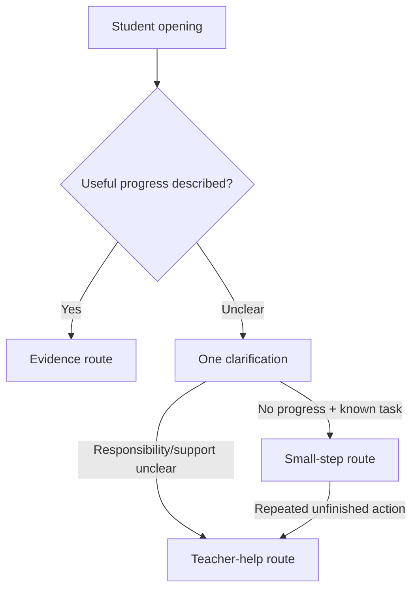

# Phase 2C Design Review 01 — Workspace and Conversation Examples

**Review purpose:** Validate the student experience before schema or UI code changes.

## Workspace layout

### Desktop

```text
┌──────────────────────────────────────────────────────────────────────────┐
│ S3 · Implementation & first test        Intake progress · 2 areas found │
├────────────────────────────────┬─────────────────────────────────────────┤
│ GUIDED CONVERSATION            │ THIS SESSION'S EVIDENCE                 │
│                                │                                         │
│ Last time you planned to fix   │ Responsibility                          │
│ mobile navigation. What        │ Frontend navigation                     │
│ happened with that plan?       │ Source: answer 1 · awaiting review      │
│                                │                                         │
│ [student answer................]│ Claim                                   │
│                                │ Mobile overlap fixed                    │
│ [Attach/reference] [No progress]│ Source: answer 1 · awaiting review      │
│ [I need Teacher help]          │                                         │
│                                │ Evidence                                │
│                 [Send]         │ Missing                                 │
│                                │                                         │
│                                │ Next action                             │
│                                │ Not captured                            │
├────────────────────────────────┴─────────────────────────────────────────┤
│ Previous commitment: Fix mobile navigation · [View previous Intake]     │
└──────────────────────────────────────────────────────────────────────────┘
```

The previous commitment stays visually separate from current evidence.
Evidence cards update after each answer and briefly highlight new/changed
fields. Selecting a source returns focus to the originating conversation turn.

### Mobile

The header remains visible. Two tabs use the same underlying state:

- **Conversation**
- **Evidence · 2 new**

The message composer stays at the bottom of the viewport. The page, rather than
a fixed-height nested modal, owns scrolling. Close/back warns only when there
are unsaved answers.

## Example A — Specific evidence

**Session focus:** S3, implementation and first executed test  
**Previous confirmed action:** Fix mobile navigation and connect dashboard data

### Turn 1

**Assistant**

> Last time you planned to fix the mobile navigation and connect dashboard
> data. What happened with that plan? Tell me what you personally changed.

**Student**

> I fixed the mobile navigation overlap and connected the project list API. The
> change is in my frontend branch. I tested desktop and mobile sizes. Desktop
> works, but on mobile the title still shifts about 8 pixels.

**Evidence workspace after turn 1**

| Card | Extracted content | State |
|---|---|---|
| Responsibility | Frontend navigation and project-list integration | AI organised; review required |
| Claim | Fixed navigation overlap and connected project-list API | Student claim |
| Evidence | Frontend branch; exact commit/reference not supplied | Partial |
| Testing | Executed on desktop and mobile | Student claim |
| Observed result | Desktop works; mobile title shifts about 8 px | Student claim |
| Previous action | Addressed in part | Continuity fact, not verification |

The AI has coverage of all three stable directions except a precise artifact
reference and next action. One combined follow-up is justified.

### Turn 2

**Assistant**

> What commit or branch should your Teacher open, and what is the next smallest
> change you will make for the remaining mobile title shift?

**Student**

> Branch `student-a/mobile-nav`, commit `8f21c4a`. I will adjust the mobile
> header spacing and show it at S4.

### Review and completion

The student sees all cards, corrects any wording, and confirms outcome
**Evidence submitted**. Teacher receives a verification task: open the named
commit, run at desktop/mobile widths, and inspect the remaining limitation.

**Design check:** two questions total; no repeated form fields; failure/limitation
is retained.

---

## Example D — Little progress, known task

**Session focus:** S2, establish individual responsibility and a first small
deliverable  
**Previous confirmed action:** None

### Turn 1

**Assistant**

> What part of the project are you responsible for, and what did you manage to
> move forward since the last class?

**Student**

> UI, but I haven't really done anything. I don't know where to start.

**Evidence workspace after turn 1**

| Card | Extracted content | State |
|---|---|---|
| Responsibility | UI, exact scope unclear | Student claim |
| Current progress | No progress reported | Explicit status |
| Evidence | Not produced | Explicit status |
| Difficulty | Does not know where to start | Student statement |

The AI stops asking for artifacts or tests. One route question identifies
whether a bounded action can be agreed.

### Turn 2

**Assistant**

> We can reduce this to one starting task. Do you already know which page you
> own, or do you need your Teacher to confirm that first?

**Student**

> I know it is the dashboard page.

### Turn 3

**Assistant**

> A possible first step is: sketch the dashboard with the three main actions
> and bring the sketch to S3. Accept this, edit it, or choose “I need Teacher
> help.”

**Student**

> I accept it. I will make it in Figma.

**Evidence workspace after turn 3**

| Card | Confirmed content | State |
|---|---|---|
| Responsibility | Dashboard UI | Student confirmed |
| Current progress | No progress this Session | Student confirmed |
| Evidence | Not produced | Student confirmed |
| Next action | Create a Figma dashboard sketch with three main actions | Student accepted |
| Due | S3 | Student accepted |
| Expected evidence | Figma sketch | Planned, not completed |

The Intake completes as **Small next step agreed**. It does not create an
evidence-verification task. The next Session should open by asking what happened
with this accepted action.

**Design check:** the record is useful despite no completed work; the AI does not
pretend that the Figma sketch already exists.

---

## Example F — Repeated unfinished action

**Session focus:** S3, demonstrate progress from the agreed first deliverable  
**Previous confirmed action:** Create a Figma dashboard sketch with three main
actions by S3

### Turn 1

**Assistant**

> Last time you agreed to create the dashboard sketch with three main actions.
> What happened with that task?

**Student**

> I still haven't done it. I wasn't sure what the three actions should be.

**Evidence workspace after turn 1**

| Card | Content | State |
|---|---|---|
| Previous action | Dashboard sketch with three actions | Previous confirmed record |
| Current progress | No progress reported | Current student statement |
| Obstacle | Unsure which three actions belong on the dashboard | Current student statement |
| Evidence | Not produced | Explicit status |
| Continuity | Previous accepted action remains unfinished | Neutral system fact |

One useful distinction remains: can existing project information resolve the
actions, or does the Teacher need to decide?

### Turn 2

**Assistant**

> Do your project brief or Team notes already name the dashboard's main user
> actions, or does your Teacher need to help confirm them?

**Student**

> The brief just says dashboard. I need the Teacher to confirm them.

### Review and completion

The student confirms outcome **Teacher help requested**:

- known responsibility: dashboard UI;
- previous action: unfinished;
- stated obstacle: required actions are unclear;
- Teacher decision requested: confirm the dashboard's main user actions;
- proposed follow-on: create the Figma sketch after that decision.

Teacher receives a **Guide progress** item, rather than an evidence verification
item.

**Design check:** two questions total; no accusation, risk score or invented
reason; the same unfinished action is visible across Sessions.

## Route transitions shown by these examples



## Review questions

1. Does the right-hand evidence area show enough value while the conversation is
   still happening?
2. In Example D, is proposing one dashboard sketch within acceptable AI
   authority, or should the system offer two choices?
3. In Example F, is the Teacher handoff early enough for a real class?
4. Should students be allowed to request Teacher help immediately from every
   turn, as proposed?
5. Which Session teaching-focus labels should be configured first for S1–S4?

Decisions from this review will control the wireframe refinement and schema
delta. No UI implementation should begin before these questions are resolved.
